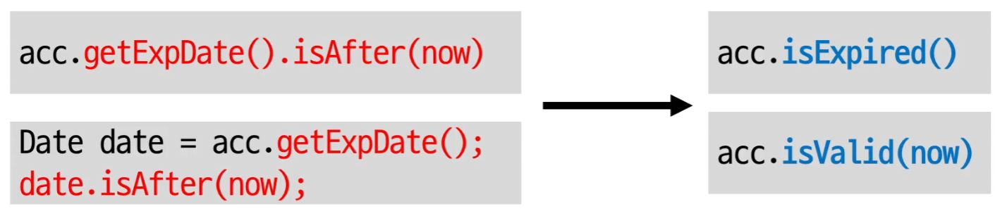

## 객체 지향

### 객체 지향과 절차 지향

##### 절차 지향

- 프로시저들이 데이터를 공유 => 문제가 발생할 여지가 생김

ex) 요구사항들이 추가될 때 코드가 복잡해지고 수정이 어려워지는 경우가 발생할 수 있다.

```python
```

##### 객체 지향

- 객체라는 단위로 데이터와 프로시저를 묶음 + 특정 객체가 갖고 있는 데이터는 그 객체의 프로시저만 접근가능하게(다른 객체가 바로 접근은 못함, 프로시저를 활용해 연결)
- 메서드를 이용해서 기능 명세 : 이름, 파라미터, 결과로 구성

- 객체와 객체가 상호 작용 = 메시지를 주고 받는다


##### 캡슐화

- 객체가 기능을 어떻게 구현했는지 외부에 감추는 것
- 외부 영향 없이 객체 내부 구현 변경 가능
- 정보 은닉 의미도 포함됨
- 기능을 제공하고 구현 상세를 감춤 => 연쇄적인 변경 전파를 최소화
- 기능에 대한 의도 이해를 높임


캡슐화를 위한 규칙

1. Tell, Don't Ask.

   데이터를 달라고 하지 말고 판단을 해달라고 하기

   ```python
   if (A.getMembership() == REGULAR) {
       ...
   }
   ```

   => **X**

   ```python
   if (A.hasRegularPermission()) {
       ...
   }
   ```

   => **O**

   

2. Demeter's Law

   - 메서드에서 생성한 객체의 메서드만 호출

   - 파라미터로 받은 객체의 메서드만 호출
   - 필드로 참조하는 객체의 메서드만 호출

   

   
