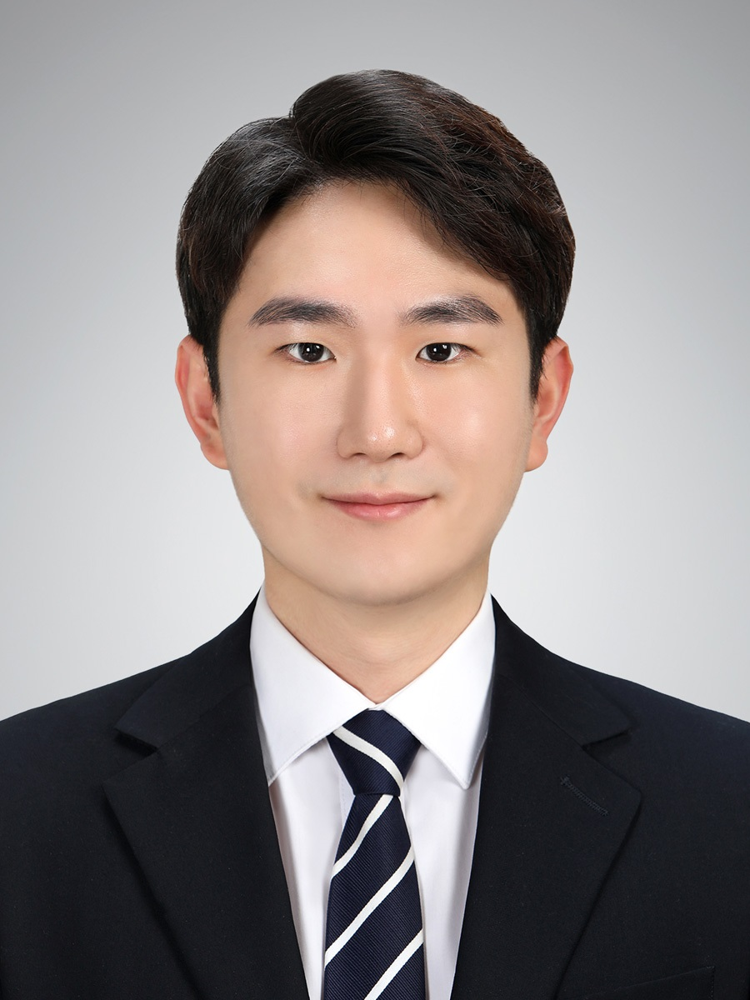

# 김승규(Seungkyu Kim)

# 빠르게 성장하는 개발자

**Github** [https://github.com/ed-kyu](https://github.com/ed-kyu)

**LinkedIn** [https://www.linkedin.com/in/seungkyu-kim-9088a21b1/](https://www.linkedin.com/in/seungkyu-kim-9088a21b1/)

---

# 😊 Introduce.

항상 기술을 동경하고 있으며 **인공지능 기술**이 추후에 삶에 녹아들것이라고 믿고 있습니다. 

발전속도는 일직선을 그린다고 생각하지 않습니다. 처음에는 **차근차근** 단계를 밟아나가면서 성장하다가, 기초를 단단히 다진 후에는 **빠르게 성장**하는 개발자가 되기 위해 노력하고 있습니다.

---

# 🛠️ Skills.

**Programming Languages** : Python, C++

**Backend Techonologies** : Django, FastAPI

**Database** : MySQL, PostgreSQL, Redshift

**Productivity Tools** : Git, VScode, Jupyter Notebook, Slack

**Others** : Airflow, Pytorch

**Cloud Services** : AWS S3, AWS Redshift

---

# 🔥 Projects.

## CNN을 활용한 예비성형체 형상 예측

**기간 | 2020.03 ~ 2020.06**

**유형 | 팀(3인)**

- 예비성형체: 단조 공정 중 최종 형상이 되기 전의 단계

- 피스톤 단조 공정 시 이용되는 예비성형체 형상을 CNN을 활용해 예측

- 최종 형상이 되기 전의 단계라 금형과 비슷한 구조를 가질수록 하중이 감소하는 경향이 있다.

- 처음 딥러닝 기술에 대해 알게 되었던 시기

  

## **영화 추천 웹 사이트 제작**

**기간 | 2021.08 ~ 2021.11**

**유형 | 팀(2인)**

- Python을 활용한 데이터 수집

- HTML, CSS 이용한 반응형 웹 페이지 구성

- Django 프레임워크 기반 웹 페이지 구현

- ORM을 이용한 DB 다루기

- CRUD 기능, 사용자 인증기반 웹 서비스 구현

- 관계형 데이터베이스 설계

- REST API 설계 (DRF, Django Rest Framework 이용)

- Vue.js를 활용한 화면 구성

- api를 활용한 사용자와 닮은 배우 필모그래피 출력 기능

  

## 마스크 착용 상태 분류 경진대회

**기간 | 2022.02.23 ~ 2022.03.03**

**유형 | 팀(5인)**

- 나이, 성별, 마스크 착용 상태를 동시에 판단하는 Task
- 노인층의 나이 데이터가 매우 부족한 현상을 해결하기 위해 Oversampling 이용
- 배경을 제거해 학습에 방해되는 noise를 줄임
- 다양한 Augmentation을 활용해 효과를 살펴봄
- 라벨별 불균형 해소를 위해 일반적으로 사용하는 cross entropy loss 대신
  
    focal loss 사용
    

## 재활용 쓰레기 Object Detection & Semantic Segmentation 경진대회

**기간 | 2022.03.21 ~ 2022.04.07 / 2022.04.25 ~ 2022.05.12**

**유형 | 팀(6인)**

- 다양한 augmentation 기법들의 성능 실험, 다양한 후처리 방법(Dense_crf, Test Time Augmentation) 실습
- mmDetection/mmSegmentation 을 이용한 Swin Transformer 등 다양한 모델 학습
- Mosaic, Cutmix Augmentation을 통해 부족한 Class의 데이터 증가
- Multi-scale로 학습, Psuedo Labeling을 통한 성능 향상
- 링크1 : https://github.com/boostcampaitech3/level2-object-detection-level2-cv-18
- 링크2: https://github.com/boostcampaitech3/level2-semantic-segmentation-level2-cv-18

## OCR 글자 검출

**기간 | 2022.04.14 ~ 2022.04.21**

**유형 | 팀(6인)**

- 팀 내 동일한 Data Annotation Guideline 설정
- Labeling 데이터 전수 검사 및 클랜징
- 오픈 데이터 셋 사용 및 적절한 annotation 여부 확인
- 데이터 셋 조절만으로도 성능의 큰 향상이 있음을 깨달음
- https://github.com/boostcampaitech3/level2-data-annotation_cv-level2-cv-18

## 피부 평가 AI 모델 제작 (ART Lab 기업 연계)

**기간 | 2022.05 ~ 2022.06**

**유형 | 팀(6인)**

- 5가지 항목(유분, 수분, 주름, 색소, 민감도)에 대한 피부 상태 분류
- Data Imbalance 문제 해결과 적절한 metric 설정
- Grad-Cam을 이용한 시각화
- Streamlit과 FastApi를 이용한 서비스 구축
- https://github.com/boostcampaitech3/final-project-level3-cv-18

## Airflow를 이용한 ETL 설계

**기간 | 2022.09 ~ 2022.10**

- MySQL에 있는 데이터를 SQL 문을 활용해 ETL 작업 후 Redshift에 적재

- Airflow를 활용해 DAGs 구성

  

---

# Work Experience.

**2021.05 ~ 2021.06** LG 이노텍 인턴

- 광학솔루션 솔루션테스트팀
- 부품 테스트 데이터(부품 적합성 여부 검사) 분석

---

# Education.

**2015.02-2021.08** 서강대학교 기계공학과

- Bachelor's degree, Mechanical Engineering (3.25 / 4.5)
- 컴퓨터공학 수업 수강(자료구조, 알고리즘, 네트워크, 운영체제, 그래픽스, 어셈블리프로그래밍)

---

# Other Experiences.

## 삼성 청년 소프트웨어 아카데미(SSAFY) 6th

**기간 | 2021.06 ~ 2022.01**

- 웹(FE/BE)
- Django를 이용한 웹 사이트 만들기
- Javascript, Vue.js를 이용한 웹 프론트엔드 페이지 제작
- 알고리즘 스터디

## 네이버 부스트캠프 AI Tech 3rd

**기간 | 2022.01 ~ 2022.06**

- Computer Vision Track
- 마스크 착용 적합 여부, 성별, 나이대 구분하는 모델 제작
- 피부 평가 모델 제작, CAM으로 시각화

## 구글 머신러닝 부트캠프 3rd

**기간 | 2022.06 ~ 2022.09**

- Andrew ng 딥러닝 특화 코세라 과정 수료
- Tensorflow 자격증 취득
- GCP ML 자격증 취득
